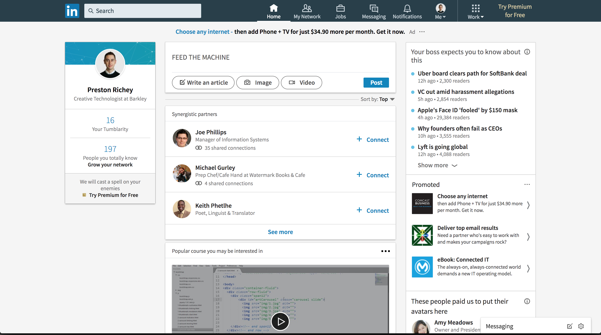

# They LinkedIn

Chrome extension that lets you see through the LinkedIn jargon. Inspired by John Carpenter's [They Live](https://en.wikipedia.org/wiki/They_Live) and an episode of [Track Changes](https://trackchanges.postlight.com/paul-and-rich-try-to-talk-about-something-else-but-end-up-complaining-about-linkedin-again-c20526cfdb74).

Basically just a fork of [cloud-to-butt](https://github.com/panicsteve/cloud-to-butt), but it runs after each AJAX GET request, since LinkedIn loads in nearly all of its content asynchronously.

## 🕶 〰️ 💀

## Installation

[Direct download of crx file](https://github.com/prichey/they-linkedin/blob/master/TheyLinkedIn.crx?raw=true)

In Chrome, choose Window > Extensions. Drag TheyLinkedIn.crx into the page that appears.

## Permissions
Needs `webRequest` to watch AJAX calls. All manipulation is done in the DOM. The extension makes no requests of its own.
